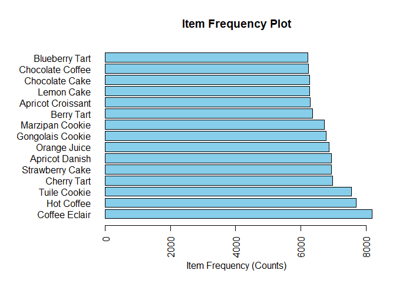
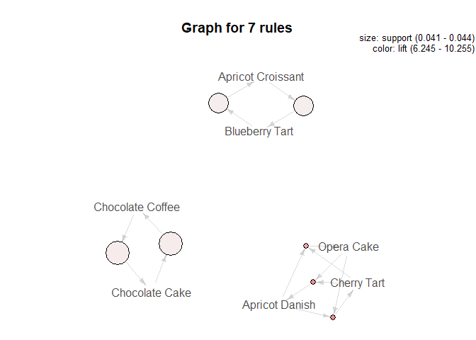

Blog Post 1: Analyzing Transactional Data Using Assocation Rules
================
Reed Gabriel
December 6, 2018

The data used in this analysis comes from a chain of bakeries. The 'purchases.csv' file contains the receipts of 75,000 transactions from these bakeries, with each row representing a receipt and each column representing whether or not a product was purchased. A '1' in the column indicates that the product was purchased for that transaction and a '0' in the column indicates that the product was not purchased for that transaction. The other file, 'items.csv', contains a list of the 50 items that can be purchased at the bakeries. The order of the rows for the items in this table corresponds to the order of the columns in the 'purchases.csv' table. So for example, row 1 (the first product) in the 'items.csv' is Chocolate Cake, and the 2nd column in the 'purchases.csv' represents whether or not each purchase contained a Chocolate Cake or not.

``` r
# Set working directory. Make sure the 2 files are placed in this location on your local system.
setwd("~/BZAN 552 - Multivariate-Data Mining II/FinalPortfolio/Post 1 - Bakery")

# Now we need to first load in the data.
purchases <- read.table("purchases.csv", head = FALSE, sep = ",", stringsAsFactors = FALSE)
items <- read.table("items.csv", head = FALSE, sep = ",", stringsAsFactors = FALSE)

# To better understand each table before continuing, we can take a look at the dimensions and first few rows.
dim(purchases)
```

    ## [1] 75000    51

``` r
head(purchases[1:5,])
```

    ##   V1 V2 V3 V4 V5 V6 V7 V8 V9 V10 V11 V12 V13 V14 V15 V16 V17 V18 V19 V20
    ## 1  1  0  0  0  0  0  0  0  0   0   0   0   1   0   0   0   0   0   0   0
    ## 2  2  0  0  0  0  0  0  0  1   0   0   0   1   0   0   0   0   0   0   0
    ## 3  3  0  0  0  1  0  0  0  0   0   0   0   0   0   0   0   0   0   0   0
    ## 4  4  0  0  0  0  0  1  0  0   0   0   0   0   1   0   0   0   0   1   0
    ## 5  5  0  0  0  0  0  0  1  0   0   0   0   0   0   0   0   0   0   0   1
    ##   V21 V22 V23 V24 V25 V26 V27 V28 V29 V30 V31 V32 V33 V34 V35 V36 V37 V38
    ## 1   0   0   1   0   0   0   0   0   0   0   0   0   0   0   0   0   0   0
    ## 2   0   0   0   0   0   0   0   0   0   0   0   0   0   0   0   0   0   0
    ## 3   0   0   0   0   0   0   0   0   0   0   0   0   0   0   1   0   0   0
    ## 4   0   0   0   0   0   0   0   0   0   0   0   0   0   0   0   0   0   0
    ## 5   0   0   0   0   0   0   0   0   0   0   0   0   0   0   0   0   0   0
    ##   V39 V40 V41 V42 V43 V44 V45 V46 V47 V48 V49 V50 V51
    ## 1   0   0   0   0   0   0   0   0   0   0   0   0   0
    ## 2   1   0   0   0   0   0   0   0   1   0   0   0   0
    ## 3   0   0   0   0   0   1   0   0   0   0   0   0   0
    ## 4   0   0   0   0   0   0   0   0   0   0   1   0   0
    ## 5   0   0   0   0   0   1   0   0   0   0   0   0   0

``` r
# The purchases dataset contains 75,000 rows (transactions) and 51 columns, with the 1st column being the row numbers, and the binary columns following that from column 2 to column 51.

dim(items)
```

    ## [1] 50  2

``` r
head(items[1:5,])
```

    ##   V1              V2
    ## 1  1  Chocolate Cake
    ## 2  2      Lemon Cake
    ## 3  3     Casino Cake
    ## 4  4      Opera Cake
    ## 5  5 Strawberry Cake

``` r
# The items dataset contains 50 rows (items) and 2 columns, with the 1st column being the row numbers, and the 2nd column showing the name of the item.
```

Now, we need to combine these tables and convert it into transactional form. Although the 'purchases.csv' does list each row as a transaction, each column is a binary variable representing the presence or absence of an item in the purchase. Transactional form gives a list of the names of the items in each transaction separated by a comma. This form is not only simpler to read and understand, but also works well with assocation rule mining techniques.

``` r
# Removing the first column in the purchases table (contains the row numbers)
purchases$V1 <- NULL
# Naming the columns as the corresponding item from the items table
colnames(purchases) <- items[,2]
# Converting to matrix
purchases <- as.matrix(purchases)
# Converting to transactional form
#install.packages("arules")
library(arules)
```

    ## Warning: package 'arules' was built under R version 3.4.4

    ## Loading required package: Matrix

    ## 
    ## Attaching package: 'arules'

    ## The following objects are masked from 'package:base':
    ## 
    ##     abbreviate, write

``` r
trans_data <- as(purchases, "transactions")

# Let's take a look at the first 5 rows of our data in transactional form to make sure it looks correct.
inspect(head(trans_data[1:5]))
```

    ##     items                
    ## [1] {Apple Pie,          
    ##      Ganache Cookie}     
    ## [2] {Coffee Eclair,      
    ##      Apple Pie,          
    ##      Almond Twist,       
    ##      Hot Coffee}         
    ## [3] {Opera Cake,         
    ##      Cheese Croissant,   
    ##      Orange Juice}       
    ## [4] {Truffle Cake,       
    ##      Apple Tart,         
    ##      Chocolate Tart,     
    ##      Vanilla Frappuccino}
    ## [5] {Chocolate Eclair,   
    ##      Cherry Tart,        
    ##      Orange Juice}

``` r
# Before applying a Market Basket Analysis, we can look at an item frequency plot to give an idea of which items are being purchased the most frequently for the time period in which this data was collected. I have chosen to look at the top 15 items.
itemFrequencyPlot(trans_data, topN = 15, type = "absolute", horiz = TRUE, col = "skyblue", main  = "Item Frequency Plot", xlab = "Item Frequency (Counts)")
```



``` r
# We see that the top item is the Coffee Eclair, which was found in over 8,000 purchases. A couple other popular items that show up in a significant number of purchases are Hot Coffee and the Tuile Cookie.
```

Before starting our Market Basket Analysis, I would like to take a moment to define three terms that are commonly used when performing association rule mining. These terms are support (sup), confidence (conf), and lift.

**Support:** The support is the fraction of transactions to which the rule may applicable, i.e., the fraction of transactions that have all items mentioned in the rule, on both the left-hand side (LHS) and right-hand side (RHS). For example, if we want to find rules that apply to at least 7,500 transactions, then we would set the support to 7,500/75,000, or 0.1. The support can be calculated from the support count, which is the frequency of occurrence of an itemset. It is the number of times that the itemset is found in a purchase/transaction.

**Confidence:** The confidence is essentially an indication of how often a rule is true and is a fraction of transactions for which the rule is true. It is the fraction/percentage of the itemset on the RHS in transactions that contain the itemset on the LHS. In other words, it is the number of transactions for which this rule is true divided by the number of transactions on the LHS that satisfy the "if" condition. It indicates how confident we can be that the RHS itemset will be in a transaction if the LHS itemset is in a transaction.

**Lift:** The lift ratio helps us determine if items are being bought at random or not. It tells us the factor by which the probability of finding an item A in the basket has increased (or decreased) once we know that an item B is in the basket. The higher the lift, the greater the chances of the RHS itemset being in the basket given that the LHS itemset is in the basket. A lift of 1 tells us that the probability of occurrence for the two events are independent of each other and the appearance of one item in the basket does not affect whether another certain item will be in the basket. A lift greater than 1 indicates a positive dependence and a complementary effect on the items, while a lift less than 1 indiciates a negative dependence and a substitution effect on the items.

``` r
# Let's start out by keeping things simple and make rules containing only 2-3 items.
basket_rules <- apriori(trans_data, parameter = list(sup = 0.04, conf = 0.5, target="rules", minlen = 2, maxlen = 3))
```

    ## Apriori
    ## 
    ## Parameter specification:
    ##  confidence minval smax arem  aval originalSupport maxtime support minlen
    ##         0.5    0.1    1 none FALSE            TRUE       5    0.04      2
    ##  maxlen target   ext
    ##       3  rules FALSE
    ## 
    ## Algorithmic control:
    ##  filter tree heap memopt load sort verbose
    ##     0.1 TRUE TRUE  FALSE TRUE    2    TRUE
    ## 
    ## Absolute minimum support count: 3000 
    ## 
    ## set item appearances ...[0 item(s)] done [0.00s].
    ## set transactions ...[50 item(s), 75000 transaction(s)] done [0.02s].
    ## sorting and recoding items ... [50 item(s)] done [0.00s].
    ## creating transaction tree ... done [0.01s].
    ## checking subsets of size 1 2 3

    ## Warning in apriori(trans_data, parameter = list(sup = 0.04, conf =
    ## 0.5, : Mining stopped (maxlen reached). Only patterns up to a length of 3
    ## returned!

    ##  done [0.02s].
    ## writing ... [16 rule(s)] done [0.00s].
    ## creating S4 object  ... done [0.01s].

``` r
# Removing rendunant rules (rules that are a subset of another)
basket_rules <- basket_rules[!is.redundant(basket_rules)]
# Checking number of rules
length(basket_rules)
```

    ## [1] 16

``` r
# Looking at all 16 rules
inspect(basket_rules)
```

    ##      lhs                             rhs                 support   
    ## [1]  {Cheese Croissant}           => {Orange Juice}      0.04306667
    ## [2]  {Truffle Cake}               => {Gongolais Cookie}  0.04392000
    ## [3]  {Napoleon Cake}              => {Strawberry Cake}   0.04314667
    ## [4]  {Blueberry Tart}             => {Apricot Croissant} 0.04350667
    ## [5]  {Apricot Croissant}          => {Blueberry Tart}    0.04350667
    ## [6]  {Chocolate Coffee}           => {Chocolate Cake}    0.04404000
    ## [7]  {Chocolate Cake}             => {Chocolate Coffee}  0.04404000
    ## [8]  {Opera Cake}                 => {Apricot Danish}    0.04302667
    ## [9]  {Opera Cake}                 => {Cherry Tart}       0.04337333
    ## [10] {Marzipan Cookie}            => {Tuile Cookie}      0.05092000
    ## [11] {Tuile Cookie}               => {Marzipan Cookie}   0.05092000
    ## [12] {Apricot Danish}             => {Cherry Tart}       0.05309333
    ## [13] {Cherry Tart}                => {Apricot Danish}    0.05309333
    ## [14] {Opera Cake,Apricot Danish}  => {Cherry Tart}       0.04110667
    ## [15] {Opera Cake,Cherry Tart}     => {Apricot Danish}    0.04110667
    ## [16] {Cherry Tart,Apricot Danish} => {Opera Cake}        0.04110667
    ##      confidence lift      count
    ## [1]  0.5238404   5.717950 3230 
    ## [2]  0.5340467   5.904983 3294 
    ## [3]  0.5214309   5.628572 3236 
    ## [4]  0.5245137   6.245203 3263 
    ## [5]  0.5180187   6.245203 3263 
    ## [6]  0.5296665   6.340780 3303 
    ## [7]  0.5272147   6.340780 3303 
    ## [8]  0.5241189   5.661662 3227 
    ## [9]  0.5283417   5.671337 3253 
    ## [10] 0.5672063   5.630025 3819 
    ## [11] 0.5054262   5.630025 3819 
    ## [12] 0.5735273   6.156369 3982 
    ## [13] 0.5699156   6.156369 3982 
    ## [14] 0.9553765  10.255222 3083 
    ## [15] 0.9477405  10.237727 3083 
    ## [16] 0.7742341   9.431144 3083

``` r
# Now I will sort the rules from highest lift to lowest lift, and then take a look at the top 7 rules.
basket_rules_sorted <- sort(basket_rules, by = "lift")
inspect(basket_rules_sorted[1:7])
```

    ##     lhs                             rhs                 support   
    ## [1] {Opera Cake,Apricot Danish}  => {Cherry Tart}       0.04110667
    ## [2] {Opera Cake,Cherry Tart}     => {Apricot Danish}    0.04110667
    ## [3] {Cherry Tart,Apricot Danish} => {Opera Cake}        0.04110667
    ## [4] {Chocolate Coffee}           => {Chocolate Cake}    0.04404000
    ## [5] {Chocolate Cake}             => {Chocolate Coffee}  0.04404000
    ## [6] {Blueberry Tart}             => {Apricot Croissant} 0.04350667
    ## [7] {Apricot Croissant}          => {Blueberry Tart}    0.04350667
    ##     confidence lift      count
    ## [1] 0.9553765  10.255222 3083 
    ## [2] 0.9477405  10.237727 3083 
    ## [3] 0.7742341   9.431144 3083 
    ## [4] 0.5296665   6.340780 3303 
    ## [5] 0.5272147   6.340780 3303 
    ## [6] 0.5245137   6.245203 3263 
    ## [7] 0.5180187   6.245203 3263

From these rules, we see that the top 3 involve the opera cake, apricot danish, and the cherry tart. These three items are found together in about 4.11% of baskets The first rules tells us that shoppers who purchase an opera cake and an apricot danish are about 10.3 times more likely to purchase a cherry tart than the average shopper. Rules 4 and 5 indicate that chocolate coffee and chocolate cake are found together in about 4.4% of baskets. These shoppers must really like chocolate! Shoppers who purchase chocolate coffee are about 6.3 times more likely to purchase a chocolate cake.

Below you will find a simple visualization for these top 7 rules. The darker the red color, the higher the lift and the larger the size of the circle, the higher the support with the grey arrows connecting the circles to the item name. We could use this plot with even more rules for a better comparison, however one needs to be careful because the more rules included, the messier the plot could become and therefore the more difficult it could be to read and interpret.

``` r
#install.packages("arulesViz")
library(arulesViz)
```

    ## Warning: package 'arulesViz' was built under R version 3.4.4

    ## Loading required package: grid

``` r
set.seed(200)
plot(basket_rules_sorted[1:7], method = "graph")
```



Finally, we will inspect rules with just 4 items included (three items in the 'if' statement and one item in the 'then' statement).

``` r
basket_rules4 <- apriori(trans_data, parameter = list(sup = 0.02, conf = 0.5, target="rules", minlen = 4, maxlen = 4))
```

    ## Apriori
    ## 
    ## Parameter specification:
    ##  confidence minval smax arem  aval originalSupport maxtime support minlen
    ##         0.5    0.1    1 none FALSE            TRUE       5    0.02      4
    ##  maxlen target   ext
    ##       4  rules FALSE
    ## 
    ## Algorithmic control:
    ##  filter tree heap memopt load sort verbose
    ##     0.1 TRUE TRUE  FALSE TRUE    2    TRUE
    ## 
    ## Absolute minimum support count: 1500 
    ## 
    ## set item appearances ...[0 item(s)] done [0.00s].
    ## set transactions ...[50 item(s), 75000 transaction(s)] done [0.02s].
    ## sorting and recoding items ... [50 item(s)] done [0.00s].
    ## creating transaction tree ... done [0.04s].
    ## checking subsets of size 1 2 3 4

    ## Warning in apriori(trans_data, parameter = list(sup = 0.02, conf =
    ## 0.5, : Mining stopped (maxlen reached). Only patterns up to a length of 4
    ## returned!

    ##  done [0.01s].
    ## writing ... [28 rule(s)] done [0.00s].
    ## creating S4 object  ... done [0.01s].

``` r
# Removing rendunant rules (rules that are a subset of another)
basket_rules4 <- basket_rules4[!is.redundant(basket_rules4)]
# Checking number of rules
length(basket_rules4)
```

    ## [1] 28

``` r
# Looking at all 16 rules
inspect(basket_rules4)
```

    ##      lhs                     rhs                     support confidence      lift count
    ## [1]  {Apple Croissant,                                                                 
    ##       Apple Danish,                                                                    
    ##       Cherry Soda}        => {Apple Tart}         0.02058667  0.9897436 14.506697  1544
    ## [2]  {Apple Tart,                                                                      
    ##       Apple Croissant,                                                                 
    ##       Cherry Soda}        => {Apple Danish}       0.02058667  0.9910141 14.639760  1544
    ## [3]  {Apple Tart,                                                                      
    ##       Apple Danish,                                                                    
    ##       Cherry Soda}        => {Apple Croissant}    0.02058667  0.9929260 14.755192  1544
    ## [4]  {Apple Tart,                                                                      
    ##       Apple Croissant,                                                                 
    ##       Apple Danish}       => {Cherry Soda}        0.02058667  0.8071093 13.020691  1544
    ## [5]  {Raspberry Cookie,                                                                
    ##       Lemon Cookie,                                                                    
    ##       Green Tea}          => {Raspberry Lemonade} 0.02073333  0.9980745 14.732451  1555
    ## [6]  {Lemon Cookie,                                                                    
    ##       Raspberry Lemonade,                                                              
    ##       Green Tea}          => {Raspberry Cookie}   0.02073333  0.9904459 14.642902  1555
    ## [7]  {Raspberry Cookie,                                                                
    ##       Raspberry Lemonade,                                                              
    ##       Green Tea}          => {Lemon Cookie}       0.02073333  0.9942455 14.618391  1555
    ## [8]  {Raspberry Cookie,                                                                
    ##       Lemon Cookie,                                                                    
    ##       Raspberry Lemonade} => {Green Tea}          0.02073333  0.8073728 12.924858  1555
    ## [9]  {Raspberry Cookie,                                                                
    ##       Lemon Cookie,                                                                    
    ##       Green Tea}          => {Lemon Lemonade}     0.02073333  0.9980745 14.625945  1555
    ## [10] {Lemon Cookie,                                                                    
    ##       Lemon Lemonade,                                                                  
    ##       Green Tea}          => {Raspberry Cookie}   0.02073333  0.9942455 14.699076  1555
    ## [11] {Raspberry Cookie,                                                                
    ##       Lemon Lemonade,                                                                  
    ##       Green Tea}          => {Lemon Cookie}       0.02073333  0.9936102 14.609051  1555
    ## [12] {Raspberry Cookie,                                                                
    ##       Lemon Cookie,                                                                    
    ##       Lemon Lemonade}     => {Green Tea}          0.02073333  0.8048654 12.884719  1555
    ## [13] {Lemon Cookie,                                                                    
    ##       Raspberry Lemonade,                                                              
    ##       Green Tea}          => {Lemon Lemonade}     0.02073333  0.9904459 14.514154  1555
    ## [14] {Lemon Cookie,                                                                    
    ##       Lemon Lemonade,                                                                  
    ##       Green Tea}          => {Raspberry Lemonade} 0.02073333  0.9942455 14.675933  1555
    ## [15] {Lemon Lemonade,                                                                  
    ##       Raspberry Lemonade,                                                              
    ##       Green Tea}          => {Lemon Cookie}       0.02073333  0.9967949 14.655874  1555
    ## [16] {Lemon Cookie,                                                                    
    ##       Lemon Lemonade,                                                                  
    ##       Raspberry Lemonade} => {Green Tea}          0.02073333  0.8090531 12.951757  1555
    ## [17] {Raspberry Cookie,                                                                
    ##       Raspberry Lemonade,                                                              
    ##       Green Tea}          => {Lemon Lemonade}     0.02074667  0.9948849 14.579204  1556
    ## [18] {Raspberry Cookie,                                                                
    ##       Lemon Lemonade,                                                                  
    ##       Green Tea}          => {Raspberry Lemonade} 0.02074667  0.9942492 14.675987  1556
    ## [19] {Lemon Lemonade,                                                                  
    ##       Raspberry Lemonade,                                                              
    ##       Green Tea}          => {Raspberry Cookie}   0.02074667  0.9974359 14.746243  1556
    ## [20] {Raspberry Cookie,                                                                
    ##       Lemon Lemonade,                                                                  
    ##       Raspberry Lemonade} => {Green Tea}          0.02074667  0.8058001 12.899681  1556
    ## [21] {Raspberry Cookie,                                                                
    ##       Lemon Cookie,                                                                    
    ##       Raspberry Lemonade} => {Lemon Lemonade}     0.02556000  0.9953271 14.585684  1917
    ## [22] {Raspberry Cookie,                                                                
    ##       Lemon Cookie,                                                                    
    ##       Lemon Lemonade}     => {Raspberry Lemonade} 0.02556000  0.9922360 14.646271  1917
    ## [23] {Lemon Cookie,                                                                    
    ##       Lemon Lemonade,                                                                  
    ##       Raspberry Lemonade} => {Raspberry Cookie}   0.02556000  0.9973985 14.745691  1917
    ## [24] {Raspberry Cookie,                                                                
    ##       Lemon Lemonade,                                                                  
    ##       Raspberry Lemonade} => {Lemon Cookie}       0.02556000  0.9927499 14.596401  1917
    ## [25] {Apple Pie,                                                                       
    ##       Almond Twist,                                                                    
    ##       Hot Coffee}         => {Coffee Eclair}      0.02792000  0.9952471  9.110648  2094
    ## [26] {Coffee Eclair,                                                                   
    ##       Apple Pie,                                                                       
    ##       Almond Twist}       => {Hot Coffee}         0.02792000  0.8135198  7.923894  2094
    ## [27] {Coffee Eclair,                                                                   
    ##       Apple Pie,                                                                       
    ##       Hot Coffee}         => {Almond Twist}       0.02792000  0.9938301 12.873447  2094
    ## [28] {Coffee Eclair,                                                                   
    ##       Almond Twist,                                                                    
    ##       Hot Coffee}         => {Apple Pie}          0.02792000  0.9928876 12.874580  2094

``` r
# Now I will sort the rules from highest lift to lowest lift, and then take a look at the top 7 rules.
basket_rules4_sorted <- sort(basket_rules4, by = "lift")
inspect(basket_rules4_sorted[1:7])
```

    ##     lhs                     rhs                     support confidence     lift count
    ## [1] {Apple Tart,                                                                     
    ##      Apple Danish,                                                                   
    ##      Cherry Soda}        => {Apple Croissant}    0.02058667  0.9929260 14.75519  1544
    ## [2] {Lemon Lemonade,                                                                 
    ##      Raspberry Lemonade,                                                             
    ##      Green Tea}          => {Raspberry Cookie}   0.02074667  0.9974359 14.74624  1556
    ## [3] {Lemon Cookie,                                                                   
    ##      Lemon Lemonade,                                                                 
    ##      Raspberry Lemonade} => {Raspberry Cookie}   0.02556000  0.9973985 14.74569  1917
    ## [4] {Raspberry Cookie,                                                               
    ##      Lemon Cookie,                                                                   
    ##      Green Tea}          => {Raspberry Lemonade} 0.02073333  0.9980745 14.73245  1555
    ## [5] {Lemon Cookie,                                                                   
    ##      Lemon Lemonade,                                                                 
    ##      Green Tea}          => {Raspberry Cookie}   0.02073333  0.9942455 14.69908  1555
    ## [6] {Raspberry Cookie,                                                               
    ##      Lemon Lemonade,                                                                 
    ##      Green Tea}          => {Raspberry Lemonade} 0.02074667  0.9942492 14.67599  1556
    ## [7] {Lemon Cookie,                                                                   
    ##      Lemon Lemonade,                                                                 
    ##      Green Tea}          => {Raspberry Lemonade} 0.02073333  0.9942455 14.67593  1555

We see that the first rule is quite different than the other 6. The first rule says that shoppers who purchase an apple tart, apple danish, and cherry soda are about 14.8 times more likely to purchase an apple croissant than the average shopper. The other remainng rules just about all involve something lemon-flavored and raspberry-flavored lemonades and cookies. It makes sense that a customer who is buying something involving those two flavors has a better chance of purchasing something else involving those flavors, like raspberry lemonade or a raspberry cookie.

I hope you have enjoyed this analysis! Thanks for reading!
