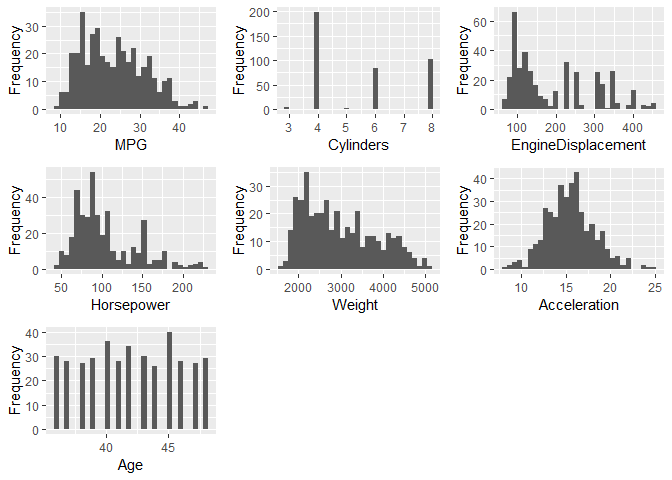
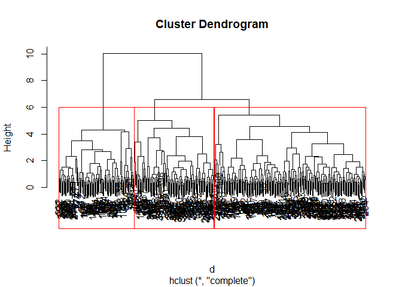
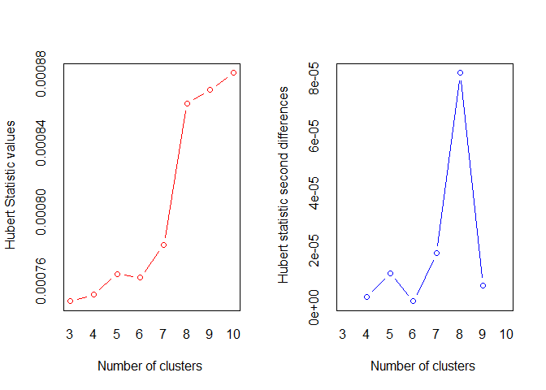
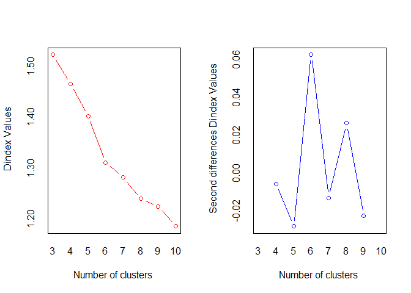
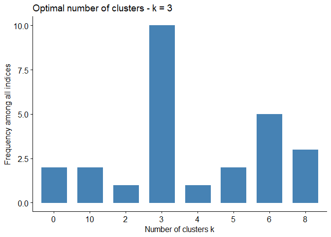
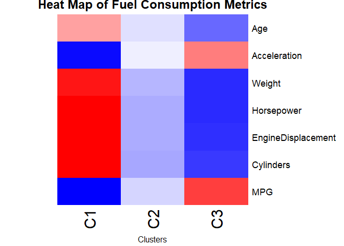

Blog Post 2: Hierarchical Clustering of Cars
================
Reed Gabriel
December 6, 2018

The data used in this analysis comes from a dataset with a variety of variables dealing with the fuel consumption in vehicles with models ranging from 1970 to 1982. The 'cars.data' file contains the data used in the analysis. The data was found from the UCI Machine Learning Repository. I am going to cluster this data using Hierarchical Clustering to try and group together cars with similar fuel consumption metrics. This analysis could be useful for consumers who are interested in purchasing a new automobile with fuel mileage being an important factor in the type of car they purchase. It could also be useful for used car dealerships in grouping vehicles together to better cater to the needs of their customers. Similar analysis could be done with data of more recent models of cars.

``` r
# Set working directory. Make sure the 'cars.data' file is placed in this location on your local system.
setwd("~/BZAN 552 - Multivariate-Data Mining II/FinalPortfolio/Post 2 - Cars")

# Now we need to first load in the data.
cars <- read.table("cars.data")

# Let's name the columns as seen from the data dictionary where this data is published for better understanding.
colnames(cars) <- c("MPG", "Cylinders", "EngineDisplacement", "Horsepower", "Weight", "Acceleration", "ModelYear", "Origin", "Car Name")

dim(cars)
```

    ## [1] 406   9

``` r
# We see that our dataset has 406 cars currently.
```

The first thing we need to do is check the data for missing values.

``` r
nrow(cars[!complete.cases(cars),])
```

    ## [1] 14

``` r
cars[!complete.cases(cars),]
```

    ##      MPG Cylinders EngineDisplacement Horsepower Weight Acceleration
    ## 11    NA         4                133        115   3090         17.5
    ## 12    NA         8                350        165   4142         11.5
    ## 13    NA         8                351        153   4034         11.0
    ## 14    NA         8                383        175   4166         10.5
    ## 15    NA         8                360        175   3850         11.0
    ## 18    NA         8                302        140   3353          8.0
    ## 39  25.0         4                 98         NA   2046         19.0
    ## 40    NA         4                 97         48   1978         20.0
    ## 134 21.0         6                200         NA   2875         17.0
    ## 338 40.9         4                 85         NA   1835         17.3
    ## 344 23.6         4                140         NA   2905         14.3
    ## 362 34.5         4                100         NA   2320         15.8
    ## 368   NA         4                121        110   2800         15.4
    ## 383 23.0         4                151         NA   3035         20.5
    ##     ModelYear Origin                         Car Name
    ## 11         70      2             citroen ds-21 pallas
    ## 12         70      1 chevrolet chevelle concours (sw)
    ## 13         70      1                 ford torino (sw)
    ## 14         70      1          plymouth satellite (sw)
    ## 15         70      1               amc rebel sst (sw)
    ## 18         70      1            ford mustang boss 302
    ## 39         71      1                       ford pinto
    ## 40         71      2      volkswagen super beetle 117
    ## 134        74      1                    ford maverick
    ## 338        80      2             renault lecar deluxe
    ## 344        80      1               ford mustang cobra
    ## 362        81      2                      renault 18i
    ## 368        81      2                        saab 900s
    ## 383        82      1                   amc concord dl

``` r
# We see that there are 14 observations that contain missing values. It appears that 8 of these observations are missing a value for MPG while the other 6 are missing a value for Horsepower.

# Let's remove these 14 observations before clustering.
cars <- na.omit(cars)

# Check to make sure that no more rows have missing values.
nrow(cars[!complete.cases(cars),])
```

    ## [1] 0

``` r
dim(cars)
```

    ## [1] 392   9

``` r
# So after removing the observations with missing measurements, we now have 392 cars in the dataset.
```

Before clustering, we will do a few more things to get the data ready.

First, we will select the quantitative columns that are most useful in the analysis. I have chosen to add a new column called "Age" which is the current age of the car and use this column when clustering instead of 'Model Year'. I think this is an easier column to interpret in terms of years since it was made rather than the actual year it was made. Since the 'Model Year' column had the year as '70' for '1970', I calculated age as the current year (2018), or 118, minus the 'Model Year' column.

Next, we will take a brief look at the columns for any potential significant outliers that could strongly influence the clustering.

Then we will standardize, or scale, the data. Otherwise, some of the variables could hold more weight over other variables and there would be issues in finding the Euclidean distance. This is because variables with larger numbers of measurement will be weighted more and have larger distances than variables with smaller numbers of measurement and therefore smaller distances. Standardizing corrects for this and allows all variables to be weighted evenly regardless of the different units of measurement.

``` r
cars$Age <- (118 - cars$`ModelYear`)
cars_subs <- cars[,c(1:6, 10)]

#install.packages("DataExplorer")
library(DataExplorer)
```

    ## Warning: package 'DataExplorer' was built under R version 3.4.4

``` r
DataExplorer::plot_histogram(cars_subs)
```



``` r
# From quickly looking at the histograms of each variable, I do not see any significant outliers that could affect the analysis, so we can move forward with standardizing the data.

# Inspect the structure of our cleaned-up dataset that is to be used for clustering
str(cars_subs)
```

    ## 'data.frame':    392 obs. of  7 variables:
    ##  $ MPG               : num  18 15 18 16 17 15 14 14 14 15 ...
    ##  $ Cylinders         : num  8 8 8 8 8 8 8 8 8 8 ...
    ##  $ EngineDisplacement: num  307 350 318 304 302 429 454 440 455 390 ...
    ##  $ Horsepower        : num  130 165 150 150 140 198 220 215 225 190 ...
    ##  $ Weight            : num  3504 3693 3436 3433 3449 ...
    ##  $ Acceleration      : num  12 11.5 11 12 10.5 10 9 8.5 10 8.5 ...
    ##  $ Age               : num  48 48 48 48 48 48 48 48 48 48 ...

``` r
# Standardizing the data
cars_subs <- scale(cars_subs)
```

We are now ready to cluster! We will use the hierarchical clustering technique.

``` r
set.seed(111)
d <- dist(cars_subs, method = "euclidean") # distance matrix
fit <- hclust(d, method = "complete")
plot(fit) # display dendogram

# Draw dendogram with red borders around the 3 clusters
rect.hclust(fit, k = 3, border = "red") 
```



As seen in the dendrogram, the 3 red boxes indicate the 3 different clusters. This looks like an appropriate number of clusters. Let's check to see if this is the ideal number for this data using a couple of packages in R to assist us!

``` r
#install.packages("NbClust")
library(NbClust)
num_clusters <- NbClust(cars_subs, distance = "euclidean", min.nc = 3, max.nc = 10, method = "complete")
```



    ## *** : The Hubert index is a graphical method of determining the number of clusters.
    ##                 In the plot of Hubert index, we seek a significant knee that corresponds to a 
    ##                 significant increase of the value of the measure i.e the significant peak in Hubert
    ##                 index second differences plot. 
    ## 



    ## *** : The D index is a graphical method of determining the number of clusters. 
    ##                 In the plot of D index, we seek a significant knee (the significant peak in Dindex
    ##                 second differences plot) that corresponds to a significant increase of the value of
    ##                 the measure. 
    ##  
    ## ******************************************************************* 
    ## * Among all indices:                                                
    ## * 10 proposed 3 as the best number of clusters 
    ## * 1 proposed 4 as the best number of clusters 
    ## * 2 proposed 5 as the best number of clusters 
    ## * 5 proposed 6 as the best number of clusters 
    ## * 3 proposed 8 as the best number of clusters 
    ## * 2 proposed 10 as the best number of clusters 
    ## 
    ##                    ***** Conclusion *****                            
    ##  
    ## * According to the majority rule, the best number of clusters is  3 
    ##  
    ##  
    ## *******************************************************************

``` r
#install.packages("factoextra")
library(factoextra)
```

    ## Warning: package 'factoextra' was built under R version 3.4.4

    ## Loading required package: ggplot2

    ## Warning: package 'ggplot2' was built under R version 3.4.4

    ## Welcome! Related Books: `Practical Guide To Cluster Analysis in R` at https://goo.gl/13EFCZ

``` r
fviz_nbclust(num_clusters)
```

    ## Among all indices: 
    ## ===================
    ## * 2 proposed  0 as the best number of clusters
    ## * 1 proposed  2 as the best number of clusters
    ## * 10 proposed  3 as the best number of clusters
    ## * 1 proposed  4 as the best number of clusters
    ## * 2 proposed  5 as the best number of clusters
    ## * 5 proposed  6 as the best number of clusters
    ## * 3 proposed  8 as the best number of clusters
    ## * 2 proposed  10 as the best number of clusters
    ## 
    ## Conclusion
    ## =========================
    ## * According to the majority rule, the best number of clusters is  3 .



As seen in the plot above, the optimal number of clusters for this data is 3. We will now continue and take a closer look at each of these 3 clusters!

``` r
set.seed(111)
# Cluster ID for each observation when cutting tree into 3 clusters
groups_cars <- cutree(fit, k = 3)

cars_clust <- cbind(cars, groups_cars)
table(cars_clust$groups_cars)
```

    ## 
    ##   1   2   3 
    ##  96 194 102

The table above shows how many observations, or cars, are in each cluster. Cluster 1 contains 96 cars, cluster 2 contains 194 cars, and cluster 3 contains 102 cars.

We will now take a look inside each of the 3 clusters and compare the cluster centroid (the means of each of the columns for the 3 clusters) in order to classify the clusters and give them a label.

``` r
show.clusters <- function(labels, k) {
  for(i in 1:k) {
    print(paste("cluster", i))
    print(colMeans(cars[labels==i,c("MPG", "Cylinders", "EngineDisplacement", "Horsepower", "Weight", "Acceleration", "Age"
    )]))
  }
}

show.clusters(groups_cars, k = 3)
```

    ## [1] "cluster 1"
    ##                MPG          Cylinders EngineDisplacement 
    ##          14.521875           7.979167         347.885417 
    ##         Horsepower             Weight       Acceleration 
    ##         161.875000        4140.791667          12.594792 
    ##                Age 
    ##          44.468750 
    ## [1] "cluster 2"
    ##                MPG          Cylinders EngineDisplacement 
    ##          23.132474           4.974227         167.064433 
    ##         Horsepower             Weight       Acceleration 
    ##          94.902062        2810.927835          15.760309 
    ##                Age 
    ##          41.989691 
    ## [1] "cluster 3"
    ##                MPG          Cylinders EngineDisplacement 
    ##          32.441176           4.058824         101.980392 
    ##         Horsepower             Weight       Acceleration 
    ##          68.637255        2199.774510          17.898039 
    ##                Age 
    ##          39.774510

**Cluster 1:** Cluster 1 can be classified as the heavier and most powerful vehicles. This cluster of cars have the lowest miles per gallon at about 14.5 MPG and the most cylinders at approximately 8. They also have the most horsepower at about 162 and the most weight. These cars also have the lowest acceleration and appear to be the oldest.

**Cluster 2:** Cluster 2 appears to be a happy medium between miles per gallon and horsepower. These can be classified as the medium-sized cars with averages of approximately 23 MPG, horsepower of about 95, and weight of about 281 all being in the middle of the spectrum.

**Cluster 3:** Cluster 3 can be classified as the group of cars that consumers would want to look at if they were focused on vehicles with the highest miles per gallon. This group of cars average about 32.4 MPG and are the lightest cars as well. These clusters also have the lowest engine displacement and the lowest horsepower.

In the graph below, you will find a heat map for the 3 clusters based on the values from the scaled dataset. The rectangles for each variable with darker red indicate higher values for that cluster, while darker blue values indicate lower values for that cluster. For example, we see that cluster 3 (C3 in the map) is red for miles per gallon and blue for weight. This indicates that cluster 3 has higher values on average for miles per gallon and lower values on average for weight. This is just a neat way to visualize the 3 different clusters!

``` r
#install.packages("gplots")
library(gplots)
```

    ## 
    ## Attaching package: 'gplots'

    ## The following object is masked from 'package:stats':
    ## 
    ##     lowess

``` r
a.mean_cars <- aggregate(cars_subs, by = list(cluster = groups_cars), FUN = 'mean')
a.std_cars <- aggregate(cars_subs, by = list(cluster = groups_cars), FUN = 'sd')
t1_cars <- t(a.mean_cars)
t2_cars <- t(a.std_cars)
t3_cars <- data.frame(t1_cars[-1,])
names_cars <- row.names(t3_cars)
rownames(t3_cars) = make.names(names_cars, unique=TRUE)
names(t3_cars) <- c("C1", "C2", "C3")
matrix_cars <- data.matrix(t3_cars)

heatmap(matrix_cars, scale = "none", col = bluered(100), Colv = NA, Rowv = NA, main = "Heat Map of Fuel Consumption Metrics", xlab = "Clusters")
```



I hope you have enjoyed this analysis! Thanks for reading!
