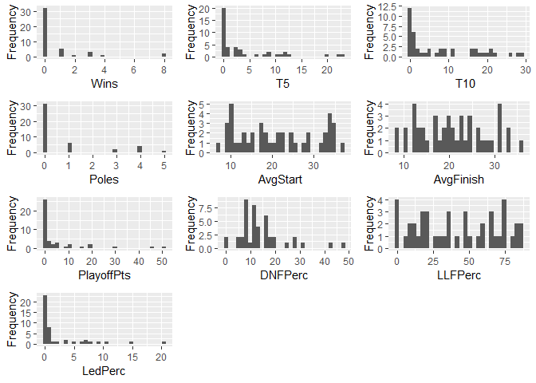
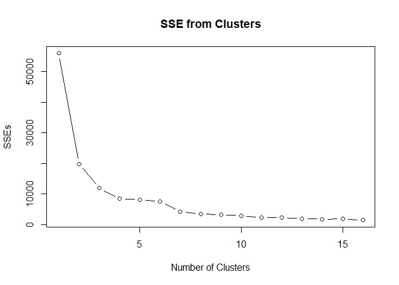
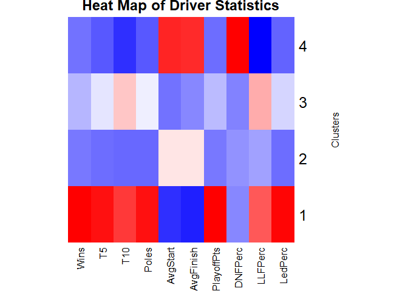

Blog Post 3: K-Means Clustering of NASCAR Drivers
================
Reed Gabriel
December 6, 2018

The data used in this analysis comes from statistics of drivers during the 2018 Monster Energy NASCAR Cup Series. The file 'nascar2018.csv' contains the data used in the analysis. The 2018 season was dominated by what many experts deemed 'The Big 3' made up of drivers Kyle Busch, Kevin Harvick, and Martin Truex, Jr. This sparked a debate as to what drivers should be in the top tier, what drivers are in a tier below that, etc. We are going to try and solve this debate by clustering this data using the K-Means Clustering technique to determine what tier each driver should be placed in based on performance during the 2018 season.

``` r
# Set working directory. Make sure the 'nascar2018.csv' file is placed in this location on your local system.
setwd("~/BZAN 552 - Multivariate-Data Mining II/FinalPortfolio/Post 3 - NASCAR")

# Now we need to first load in the data.
nascar <- read.csv("nascar2018.csv", header = TRUE)

dim(nascar)
```

    ## [1] 73 16

``` r
# This dataset has 73 rows (73 drivers) and 16 columns.
```

Before getting started, we can go ahead and remove certain columns that we are not going to use in this analysis. These columns include Points (points earned during the season) and Diff (points behind the 1st place driver). The points are altered during the playoff portion of the 2018 season so that drivers in the playoffs are thousands of points ahead of the non-playoff drivers in order to separate themselves. Therefore it isn't quite a fair representation of performance, so these columns will be removed. PlayoffPts, as opposed to standard Points based on the finshing position, will be kept since Playoff Points are earned and accumulated throughout the season by all drivers. We are also going to remove 'Miles' since it is fairly redundant of the number of laps completed.

``` r
nascar$Points <- NULL
nascar$Diff <- NULL
nascar$Miles <- NULL

# Checking the data for missing values.
nrow(nascar[!complete.cases(nascar),])
```

    ## [1] 0

``` r
# No missing values so we can continue.
```

Now we are going to add a few columns that we think are interesting and help determine driver performance.

The first column we are going to add is 'DNFPerc'. It is simply the number of races that a driver did not finish (due to a crash, mechanicle failure, etc.). This can be calculated by subtracting the 'RAF' (Running at Finish) column from the 'Races' column and then dividing that by the 'Races' column. This gives the percentage of races that drivers did not finsh since some drivers run a different number of races during the season. For example, a driver that had 2 DNFs and competed in 36 races performed much better than a driver that had 2 DNFs but only competed in 5 races. We will then remove the 'RAF' column.

The second column we are going to add is 'LLFPerc'. It is the 'LLF' (lead-lap finishes a.k.a. number of times drivers finished the race on the lead lap and did not get lapped) divided by 'Races'. This gives the pecentage of time that drivers finished the race on the lead lap based on the number of races the drivers competed in. We will then remove the 'LLF' column.

The third column we are going to add is 'Led%'. It is the 'LapsLed' divided by the 'LapsComp' and is defined as the percentage of laps that drivers led based on the total number of laps that drivers completed.

Lastly, we are going to remove the drivers that competed in fewer than 10 races in order to remove the drivers that did not race much so we can focus our clustering on drivers who somewhat regularly race. Additionally, a small sample size of less than 10 races could not accurately reflect the performance of a driver.

``` r
nascar$DNFPerc <- (((nascar$Races - nascar$RAF) / nascar$Races) * 100)
nascar$RAF <- NULL

nascar$LLFPerc <- ((nascar$LLF / nascar$Races) * 100)
nascar$LLF <- NULL

nascar$LedPerc <- ((nascar$LapsLed / nascar$LapsComp) * 100)

nascar <- nascar[!(nascar$Races < 10),]
```

Now we are going to look at the structure of the datset and define each column for a better understanding.

``` r
str(nascar)
```

    ## 'data.frame':    44 obs. of  14 variables:
    ##  $ Driver    : Factor w/ 73 levels "   A.J. Allmendinger",..: 41 52 45 47 4 12 46 8 48 63 ...
    ##  $ Races     : int  36 36 36 36 36 36 36 36 36 36 ...
    ##  $ Wins      : int  3 4 8 8 1 3 1 3 0 1 ...
    ##  $ T5        : int  13 20 23 22 4 11 6 12 12 8 ...
    ##  $ T10       : int  26 21 29 28 17 21 22 20 19 16 ...
    ##  $ Poles     : int  1 4 4 4 0 1 5 0 3 3 ...
    ##  $ LapsComp  : int  9826 9760 9691 10001 10003 9850 9992 9788 9768 9525 ...
    ##  $ LapsLed   : int  934 1016 1990 1469 181 325 644 705 782 660 ...
    ##  $ AvgStart  : num  9.8 9.9 8.8 7.4 15.6 11.1 8.8 10.3 12.8 9.4 ...
    ##  $ AvgFinish : num  10.7 10.7 8.8 8.3 12.8 12.2 12.1 13.4 12.6 14.8 ...
    ##  $ PlayoffPts: int  15 30 51 46 6 19 8 20 4 11 ...
    ##  $ DNFPerc   : num  8.33 13.89 11.11 8.33 5.56 ...
    ##  $ LLFPerc   : num  83.3 83.3 86.1 86.1 75 ...
    ##  $ LedPerc   : num  9.51 10.41 20.53 14.69 1.81 ...

``` r
# Column 1: Driver - Name of the driver
# Column 2: Races - Number of races the driver competed in
# Column 3: Wins - Number of times the driver won the race
# Column 4: T5 - Number of top-5 finishes (positions 1-5)
# Column 5: T10 - Number of top-10 finshes (positions 1-10)
# Column 6: Poles - Number of poles won (number of times the driver started the race in the 1st position)
# Column 7: LapsComp - Total number of laps completed
# Column 8: LapsLed - Total number of laps completed in 1st place
# Column 9: AvgStart - Average position the driver started in
# Column 10: AvgFinish - Average position the driver finished in
# Column 11: PlayoffPts - Total number of Playoff Points the driver accumulated
# Column 12: DNFPerc - Percentage of times the driver did not finish the race
# Column 13: LLFPerc - Percentage of times the driver finished the race on the lead lap
# Column 14: LedPerc - Percentage of laps that the driver led
```

Now, we will select the columns that we want to include when clustering. We will then quickly check these variables for any significant outliers that could strongly affect the clustering. Lastly, we will standardize, or scale, the data. Otherwise, some of the variables could hold more weight over other variables. Standardizing corrects for the different measurements (percentages vs. counts for example) and allows all variables to be weighted evenly regardless of the different units of measurement.

``` r
nascar_subs <- nascar[,c(3:6, 9:14)]

#install.packages("DataExplorer")
library(DataExplorer)
```

    ## Warning: package 'DataExplorer' was built under R version 3.4.4

``` r
DataExplorer::plot_histogram(nascar_subs)
```



``` r
# From looking at the histograms of each variable, I do not see any significant outliers that could affect the analysis, so we can move forward with clustering.
```

We are now ready to cluster! We will cluster use the k-means algorithm with the most interpretable k of 4 clusters.

``` r
set.seed(30)
fit_k <- kmeans(nascar_subs, 4)
fit_k
```

    ## K-means clustering with 4 clusters of sizes 3, 13, 13, 15
    ## 
    ## Cluster means:
    ##         Wins          T5        T10     Poles AvgStart AvgFinish
    ## 1 6.66666667 21.66666667 26.0000000 4.0000000  8.70000  9.266667
    ## 2 0.07692308  1.15384615  4.1538462 0.1538462 21.19231 20.823077
    ## 3 1.15384615  7.61538462 17.1538462 1.4615385 12.31538 13.838462
    ## 4 0.00000000  0.06666667  0.3333333 0.0000000 31.39333 29.193333
    ##   PlayoffPts  DNFPerc  LLFPerc     LedPerc
    ## 1 42.3333333 11.11111 85.18519 15.21096126
    ## 2  0.7692308 11.26496 39.31002  0.30333869
    ## 3  7.8461538 10.89744 70.51282  4.20483469
    ## 4  0.0000000 20.70080 10.48529  0.04432578
    ## 
    ## Clustering vector:
    ##  1  2  3  4  5  6  7  8  9 10 11 12 13 14 15 16 17 18 19 20 21 22 23 24 25 
    ##  3  1  1  1  3  3  3  3  3  3  3  3  2  3  3  3  3  2  2  2  2  2  2  2  2 
    ## 26 27 28 29 30 31 32 33 34 35 36 37 51 52 53 54 55 56 57 
    ##  4  2  4  4  2  4  2  2  4  4  4  4  4  4  4  4  4  4  4 
    ## 
    ## Within cluster sum of squares by cluster:
    ## [1]  372.5868 2020.4689 2280.8370 3745.4905
    ##  (between_SS / total_SS =  84.9 %)
    ## 
    ## Available components:
    ## 
    ## [1] "cluster"      "centers"      "totss"        "withinss"    
    ## [5] "tot.withinss" "betweenss"    "size"         "iter"        
    ## [9] "ifault"

Before moving forward, I will take a more comprehensive approach in determining the number of clusters to use by minimizing SSE (sum of squared errors).

``` r
set.seed(300)
SSEs <- rep(NA,10) # a vector to store SSEs for different k's
SSEs[1] <- fit_k$totss # total SSE if no clustering is done

for(k in 2:16){
    fit_k <- kmeans(nascar_subs, k)
    SSEs[k] <- fit_k$tot.withinss
}

plot(1:16, SSEs, type = "b", main = "SSE from Clusters", xlab="Number of Clusters")
```



Following this approach, 4 clusters seems to be an appropriate number! There is a fairly noticeable drop in SSE as the number of clusters increases until the increase from 4 to 5 which is much smaller of a drop. We will move forward with the k-means clustering of 4 clusters we used above! We will take a closer look now at how many drivers are in each cluster as well as the average statistics of each cluster.

``` r
set.seed(30)
fit_k <- kmeans(nascar_subs, 4)

# Adding column to dataset with the number of the cluster that each driver is in.
nascar_subs$clusterid <- fit_k$cluster
nascar$clusterid <- fit_k$cluster

fit_k$size
```

    ## [1]  3 13 13 15

``` r
fit_k$centers
```

    ##         Wins          T5        T10     Poles AvgStart AvgFinish
    ## 1 6.66666667 21.66666667 26.0000000 4.0000000  8.70000  9.266667
    ## 2 0.07692308  1.15384615  4.1538462 0.1538462 21.19231 20.823077
    ## 3 1.15384615  7.61538462 17.1538462 1.4615385 12.31538 13.838462
    ## 4 0.00000000  0.06666667  0.3333333 0.0000000 31.39333 29.193333
    ##   PlayoffPts  DNFPerc  LLFPerc     LedPerc
    ## 1 42.3333333 11.11111 85.18519 15.21096126
    ## 2  0.7692308 11.26496 39.31002  0.30333869
    ## 3  7.8461538 10.89744 70.51282  4.20483469
    ## 4  0.0000000 20.70080 10.48529  0.04432578

**Cluster 1:** Cluster 1 contains 3 drivers. This is by far the top tier as these drivers have on average about 6.7 wins and 21.7 top-5 finishes. They have the lowest average finish position, as well as the highest percentages of lead-lap finshes and laps led on average.

**Cluster 2:** Cluster 2 contains 13 drivers. This appears to be the third tier from the top. On average these drivers have about 1.2 top-5 finishes and they also have an average finish of about 21, which is 8 positions better than the lowest tier. These drivers also finish on the lead lap about 39% of the time on average, which is much better than the 10% in the lowest tier.

**Cluster 3:** Cluster 3 contains 13 drivers. This is the second tier of drivers; they are still very good, but not quite on the high level of the drivers in Cluster 1. The drivers in Cluster 3 win about 1.2 times and finish in the top 5 about 7.6 times on average. They have the second highest percentages of lead-lap finishes and laps led on average.

**Cluster 4:** Cluster 4 contains 15 drivers. This appears to be the lowest tier of drivers, as these drivers do not have any wins and on average have 0.067 top-5 finshes. This cluster of drivers has an average starting position of 31.4 and an average finishing position of about 29. Additionally, on average they do not finish races approximately 20.7% of the times they race, which is the most of any cluster.

In the graph below, we have created a heat map for the 4 clusters based on the averages of the statistics for the drivers in each cluster. I scaled the data for the use of this heat map for a more accurate depiction of the different clusters. This is a way to visualize the 4 clusters rather than just strictly comparing the numerical averages. The rectangles for each variable with darker red indicate higher values for that cluster, while darker blue values indicate lower values for that cluster. For example, we see dark blue rectangles for the average starting position and average finishing position for cluster 1 (which we know is the top tier) indiciating the best (lowest) positions on average. On the other hand, we see red rectangles for these statistics for Cluster 4, the lowest tier, indicating the worst (highest) average starting and finishing positions.

``` r
#install.packages("gplots")
library(gplots)
```

    ## 
    ## Attaching package: 'gplots'

    ## The following object is masked from 'package:stats':
    ## 
    ##     lowess

``` r
heatmap(scale(fit_k$centers), scale = "none", col = bluered(100), Colv = NA, Rowv = NA, main = "Heat Map of Driver Statistics", ylab = "Clusters")
```



This last table below shows the name of the driver along with the number of the cluster that they have been placed in. One interesting thing to note is that 'The Big 3' drivers are in their own cluster, Cluster 1, which is the top tier. This signifies that as suspected, these drivers are in a league of their own! Their performance on the race track has separated themselves from the rest of the field. This analysis allows us to see which drivers are placed in the second tier and are looking to join The Big 3, as well as the other drivers in the bottom 2 tiers who have a lot of room for improvement!

``` r
(ClusterAssignments <- data.frame(nascar$Driver, nascar$clusterid))
```

    ##              nascar.Driver nascar.clusterid
    ## 1              Joey Logano                3
    ## 2        Martin Truex, Jr.                1
    ## 3            Kevin Harvick                1
    ## 4               Kyle Busch                1
    ## 5            Aric Almirola                3
    ## 6            Chase Elliott                3
    ## 7               Kurt Busch                3
    ## 8          Brad Keselowski                3
    ## 9              Kyle Larson                3
    ## 10             Ryan Blaney                3
    ## 11            Denny Hamlin                3
    ## 12            Clint Bowyer                3
    ## 13           Austin Dillon                2
    ## 14          Jimmie Johnson                3
    ## 15              Erik Jones                3
    ## 16             Alex Bowman                3
    ## 17             Ryan Newman                3
    ## 18    Ricky Stenhouse, Jr.                2
    ## 19             Paul Menard                2
    ## 20          Jamie McMurray                2
    ## 21           Daniel Suarez                2
    ## 22       A.J. Allmendinger                2
    ## 23           William Byron                2
    ## 24          Chris Buescher                2
    ## 25             David Ragan                2
    ## 26        Michael McDowell                4
    ## 27               Ty Dillon                2
    ## 28           Bubba Wallace                4
    ## 29        Matt DiBenedetto                4
    ## 30             Kasey Kahne                2
    ## 31            Trevor Bayne                4
    ## 32            Matt Kenseth                2
    ## 33             Regan Smith                2
    ## 34            Corey LaJoie                4
    ## 35              Cole Whitt                4
    ## 36           Gray Gaulding                4
    ## 37       Jeffrey Earnhardt                4
    ## 38           Ross Chastain                4
    ## 39          Landon Cassill                4
    ## 40              Timmy Hill                4
    ## 41              J.J. Yeley                4
    ## 42           Reed Sorenson                4
    ## 43             B.J. McLeod                4
    ## 44         D.J. Kennington                4

I hope you have enjoyed this analysis! Thanks for reading!
